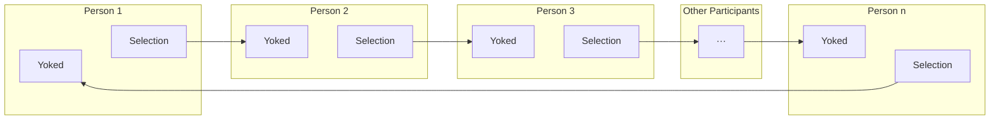
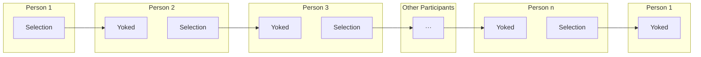
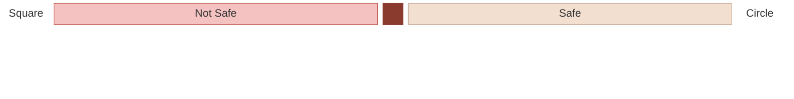
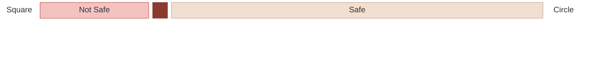
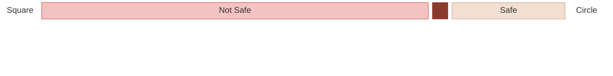
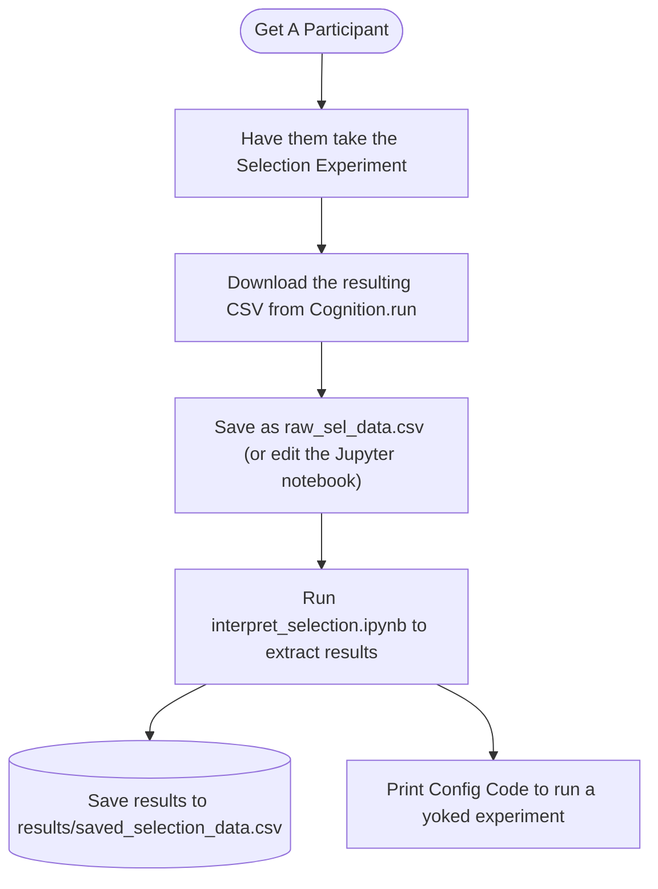
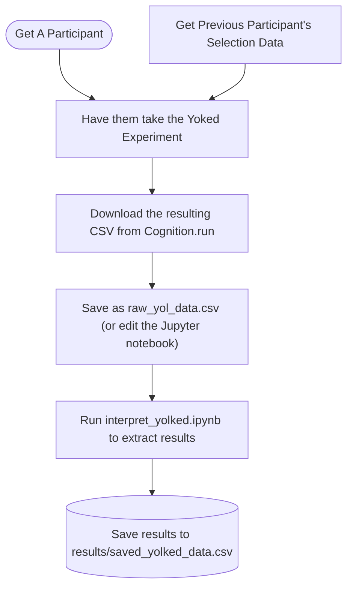

# Experimental Design
As a part of this project, we designed an experiment using JSPsych on Cognition.run, and this is where we dicuss how to run our experiment.

## Select The Participants

The participants are linked in a circular chain — each person's selection stimulus becomes the next person's yoked stimulus, with Person n feeding back to Person 1.

When unrolled in time, the cycle begins with Person 1 completing only the Selection task, each subsequent participant completing Yoked then Selection, and the cycle closes when Person 1 returns to complete the Yoked task using Person n's selection.

## How Categorization Works

The stimulus space runs from a perfect square to a perfect circle. A hidden category boundary divides the space into shapes that are **Not Safe** (sharp corners) and **Safe** (rounded corners) for children. 

What exactly counted as save varied between experiments, but were consistant across the multiple loops in one experiment. Thus, each participant only had to identify two separate boundaries, one for their [selection experiment](./selection_code.md) and one for their [yoked experiment](./yoked_code.md).

## Running The Experiment

The process of running an experiment is a fairly manual one, and is described below. The how these tests are run is described in more detail by the [Selection Code](./selection_code.md) and [Yoked Code](./yoked_code.md) sections, but here we are more concerned with this manual aspect.

As previously noted, each participant is expected to run two both the selection experiment and the yoked experiment, although the order they are taken can be swapped for all but the first participant. Thus, the process of running an experiment has been split into these two parts with the assumption that you will do both for each participant.

### Selection Experiment

### Yoked Experiment

## The Infrastructure
The Javascript code used to run the experiment is setup and explained here.

[Selection Experiment](./selection_code.md){.md-button .md-button--primary}
[Yoked Experiment](./yoked_code.md){.md-button .md-button--primary}
