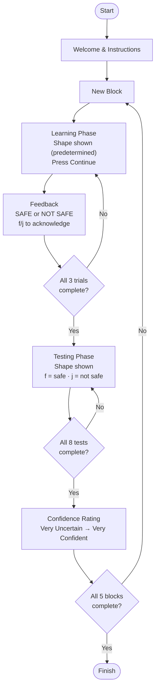

# Yoked Code

Yoked code the code used to run the Yoked Experiment, which is where we tested the participant's ability to judge where a category boundary was when they were shown the examples chosen by a [selection learner](./selection_code.md#configuring-the-experiment) but given no ability to change them. The structure of this code is based on data from a [selection experiment](./selection_code.md#configuring-the-experiment), and requires pasting in configuration prior to each run. 

## Configuring The Experiment

This code requires pasting in configuration at the very top of [the code, specifically lines 1-22](#the-code). The experiment was designed to be highly flexible to permit a large degree of customization. An example of what the configuration extracted from the selection experiment looked like [can be seen here](./selection_code.md#configuring-the-experiment).

## Experiment Flow

Although the code is very adaptable [as noted previously](./selection_code.md#configuring-the-experiment), the flowchart below describes the general structure. The specific numbers shown in the flowchart below shows what were used in our experiment so that each trial lasts about 5 minutes.



## The Code

To use this code as we do, run it using [jsPsych](https://www.jspsych.org/v8/plugins/list-of-plugins/) using [Cognition.run](https://www.cognition.run/). 

``` javascript linenums="1"
/**************** START PASTE ******************/

const CATEGORY_BOUNDARY = 0.78;
const SELECTION_UUID = "bf93e71f-56f1-4a3c-bd91-dd8f3a7bc3d6";

const YOKED_STIMULI = [
	[0.5, 0.5, 0.5],
	[0.6200000000000001, 0.6600000000000001, 0.7200000000000002],
	[1.0, 0.7800000000000002, 0.6400000000000001],
	[0.7400000000000003, 0.7600000000000002, 0.8000000000000003],
	[0.7799999999999998, 0.8000000000000003, 0.6200000000000001],
	];

const TEST_STIMULI = [
	[0.9396947414307608, 0.0234110898123689, 0.6750859732927152, 0.6397936329805283, 0.1102284208119093, 0.2299365055250217, 0.9392432748523424, 0.5829814817316376],
	[0.8322789339654696, 0.8047387068781265, 0.337394520020785, 0.7978812811586584, 0.8471905165291707, 0.0618246841846181, 0.124540220452211, 0.2465975364483758],
	[0.873090833301332, 0.9587141782635464, 0.2969097840373907, 0.0861214700719469, 0.1960852779326032, 0.2131252724082943, 0.4472649776784672, 0.3655655036463303],
	[0.8201964911453388, 0.3501249434217023, 0.0125005820051942, 0.0919314110199933, 0.2685178143583174, 0.2973871075347529, 0.1075160594808291, 0.2746110643041985],
	[0.5551940370896621, 0.5274432602124631, 0.9787070743181606, 0.1981885729579713, 0.0947474389856174, 0.8594273293841408, 0.8326313004820439, 0.6665459948173644],
	];

/***************** END PASTE *******************/

/*
 * DATA FOR YOKED EXPERIMENT
 * All this data should be pasted in from SELECTION Experiment results.
 * 
 * CATEGORY_BOUNDARY = The point beyond which it becomes safe
 *
 * SELECTION_UUID = This is a unique identifier to relate selection and yoked experiments together.
 *    This should be saved with the selection data, and copied into the corresponding yoked experiment.
 *
 * YOKED_STIMULI = A list of the yoked stimuli roundness numbers from the selection test.
 *       [ [individual tests], [...], ... number of test total ]
 *
 * TEST_STIMULI = A list of the test stimuli roundness numbers. Must be same length as YOKED_STIMULI.
 *       [ [individual tests], [...], ... number of test total ]
 *
 */


/* initialize jsPsych */
var jsPsych = initJsPsych({
  on_finish: function() {
    jsPsych.data.displayData();
  }
});

/* create timeline */
var timeline = [];

// function to categorize stimuli (TRUE=safe, FALSE = not safe)
function is_safe(value) {
  return value >= CATEGORY_BOUNDARY;
}

function generate_experiment_variables(test_stimuli, yoked_stimuli) {
  if (!(test_stimuli.length == yoked_stimuli.length)) throw new Error("TEST_STIMULI and YOKED_STIMULI should be the same length but aren't.");
  
  var joint_stimuli = []
  for (var i = 0; i < test_stimuli.length; i++) {
    joint_stimuli.push([test_stimuli[i],yoked_stimuli[i]]);
  }
  
  return joint_stimuli.map((j_list, i) => {
    return {
      iteration: i,
      test_stimuli: j_list[0].map((r) => {
        return {
          roundness: r
        }
      }),
      yoked_stimuli: j_list[1].map((r) => {
        return {
          roundness: r
        }
      }),
    }
    
  })
}


const experiment_variables = generate_experiment_variables(TEST_STIMULI, YOKED_STIMULI);
console.log(experiment_variables);

// Method To Draw Stimulus
function drawStimulusSvg(roundness) {
  // roundness = 0 to 1
  // length = 200
  length = 300;
  var width = length;
  var height = length;
  var rx = roundness * Math.min(width, height) / 2;
  return `<svg width="${width+100}" height="${height+100}" xmlns="http://www.w3.org/2000/svg">
    <rect x="50" y="50" width="${width}" height="${height}" rx="${rx}" ry="${rx}" fill="black"/>
  </svg>`;
}


/* define welcome message trial */
var welcome = {
  type: jsPsychHtmlKeyboardResponse,
  stimulus: `Selection UUID: ${SELECTION_UUID}<br><br>Welcome to the yoked experiment! It will be conducted in multiple blocks of two phases each, with each block consisting a learning phase followed by a testing phase. Press any key to continue to experiment instructions.`,
  data: {
    task: 'welcome',
    UUID: `${SELECTION_UUID}`,
    category_boundary: `${CATEGORY_BOUNDARY}`,
  }
};
timeline.push(welcome);

/* define instructions trial */
var instructions = {
  type: jsPsychHtmlKeyboardResponse,
  stimulus: `
    <p>Imagine you are a toy designer, who is developing a new toy for babies.
    You are conducting market research prior to the release of your new toy to be sure that you fully understand <u>where the boundary is between safe and unsafe.</u><br><br>
    
    <p><b>Learning Phase Instructions:</b></p>
    In this phase of the experiment, your task is to identify the threshold for how sharp the corners of 
    new toy can be before it becomes unsafe for young children, through learning about different examples.
    On the next screen you will be shown a sample toy. Press the continue button to find out if that particular toy would be SAFE or UNSAFE for babies. You will be asked to 
    repeat this process multiple times, to allow you to narrow in on the boundary of acceptable corner sharpness<br><br>
    
    <p><b>Testing Phase Instructions:</b></p>
    In this phase of the experiment, your task is to judge if the toys shown on the screen would be considered SAFE or UNSAFE,
    based off what you learned in the learning phase about how sharp the corners can be.<br><br>
    
    <p>Press any key to continue</p>
  `,
  post_trial_gap: 10
};
 timeline.push(instructions);

var block_complete_screen = {
  type: jsPsychHtmlKeyboardResponse,
  stimulus: `
    <p>You will be starting a new learning block followed by a testing block.<br> Press any key to continue.</p>
  `//,
  //post_trial_gap: 10
};
 //timeline.push(block_complete_screen);
 
 /* Last screen of experiment*/
var finish_screen = {
  type: jsPsychHtmlKeyboardResponse,
  stimulus: `
    <p>This concludes the experiment, your participation is appreciated! <br> Press any key to exit.</p>
  `//,
  //post_trial_gap: 10
};
 

/************* DEFINE MAIN EXPERIMENT LOOP ******************/
// Every time we go through this loop, increment variable.
var current_iteration = 0;
var current_test = 0;
var current_learn = 0;

var yoked_trial = {
  type: jsPsychHtmlButtonResponse,
  stimulus: function () {
    var roundness = experiment_variables[current_iteration].yoked_stimuli[current_learn].roundness;
    console.log(roundness);
    return 'Learning Phase<br>' + drawStimulusSvg(roundness);
  },
  choices: ['Continue'],
  //prompt: "<p>What color is the ink?</p>"
  data: {
    task: 'yoked_trial',
    roundness: function () {
        var roundness = experiment_variables[current_iteration].yoked_stimuli[current_learn].roundness;
        return roundness
      },
  }
};


//Shows what previously selected object looks like.
var categorize_trial = {
    type: jsPsychHtmlKeyboardResponse,
    stimulus: function () {
      var roundness = experiment_variables[current_iteration].yoked_stimuli[current_learn].roundness;
      var message = ""
      if (is_safe(roundness)) {
        message = `<p style="font-size:48px; color:green;">SAFE for children</p>`
      } else {
        message = `<p style="font-size:48px; color:red;">NOT SAFE for children</p>`
      }
      console.log(roundness);
      return drawStimulusSvg(roundness) + message
    },
    choices: function() {
      //['f', 'j'], //remove incorrect answer
      //Make it so that they can only press the correct key to continue
      var roundness = experiment_variables[current_iteration].yoked_stimuli[current_learn].roundness;
      if (is_safe(roundness)) {
        return ['f'];
      }
      return ['j'];
    },
    prompt: "<p> Acknowledge result: 'f' = safe, 'j' = not safe</p>",
    data: {
      task: 'categorize_trial'
    }
};
// timeline.push(categorize_trial);


var learn_procedure = {
  timeline: [yoked_trial, categorize_trial],
  loop_function: function() {
    current_learn++;
    return current_learn < experiment_variables[current_iteration].yoked_stimuli.length;
  }
}

// timeline.push(learn_procedure);


var test_trial = {
    type: jsPsychHtmlKeyboardResponse,
    stimulus: function () {
      var roundness = experiment_variables[current_iteration].test_stimuli[current_test].roundness;
      console.log(roundness)
      return 'Testing Phase<br>' + drawStimulusSvg(roundness);
      },
    choices: ['f', 'j'],
    prompt: "<p> Categorize the toy: 'f' = safe, 'j' = not safe</p>",
    data: {
      task: 'test_trial',
      correct_answer: function () {
        var roundness = experiment_variables[current_iteration].test_stimuli[current_test].roundness;
        return is_safe(roundness) ? 'f' : 'j'
      },
      roundness: function () {
        var roundness = experiment_variables[current_iteration].test_stimuli[current_test].roundness;
        return roundness
      },
    },
    on_finish: function(data){
      data.correct = jsPsych.pluginAPI.compareKeys(data.response, data.correct_answer);
    }
};
// timeline.push(trial);

var fixation = {
  type: jsPsychHtmlKeyboardResponse,
  stimulus: '<div style="font-size:60px;">+</div>',
  choices: "NO_KEYS",
  trial_duration: function(){
    return jsPsych.randomization.sampleWithoutReplacement([100, 150, 200, 250, 300, 350, 400, 450, 500])[0];
  },
  data: {
    task: 'fixation'
  }
};

var test_loop = {
  timeline: [fixation, test_trial],
  loop_function: function() {
    current_test++;
    return current_test < experiment_variables[current_iteration].test_stimuli.length;
  }
}

var test_rating = {
  type: jsPsychSurveyLikert,
  questions: [
    {
      prompt: "How certain are you that you categorized toys correctly?", 
      labels: [
        "Very Uncertain", 
        "Uncertain", 
        "Neutral", 
        "Confident", 
        "Very Confident"
      ]
    }
  ],
  data: {
    task: 'test_rating'
  }
};


var experiment_procedure = {
  timeline: [block_complete_screen, learn_procedure, test_loop, test_rating],
  loop_function: function() {
    // Loop until reach the end of scheduled experiment
    current_iteration++;
    current_learn = 0;
    current_test = 0;
    var continue_loop = current_iteration < experiment_variables.length;
    return continue_loop;
  },
}
timeline.push(experiment_procedure);

timeline.push(finish_screen);

/* start the experiment */
jsPsych.run(timeline);
```